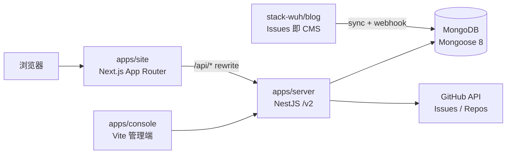

# x.wuh.site

[](https://github.com/stack-wuh/x.wuh.site/releases)
[](https://github.com/stack-wuh/x.wuh.site/actions/workflows/ci-cd.yml)

个人站点（[wuh.site](https://wuh.site)）的全栈 monorepo：博客、留言板、足迹、关于页与后台 Console，一套仓库覆盖前端、后端、组件库与共享层。

内容不以数据库为源头，而是以 **GitHub Issues 作为 CMS**——写作即提 Issue，NestJS 后端聚合 Issues/Repos 并落库 MongoDB，前端只消费统一的 `/v2` API。

## 功能特性

- **博客**：Issue 即文章，GitHub Markdown 渲染 + 代码高亮（Shiki）、章节眉线记号、首字下沉等书页式排版
- **话题聚合**：Issue label 即话题，`/topics/<label>` 聚合页 + 博客列表多标签 AND 筛选
- **留言板**：弹幕式留言 + 虚拟滚动，评论支持匿名与审核
- **骨架屏与加载体验**：详情页骨架屏整页镜像终态布局（复用布局壳组件），404/500 统一 Result 组件
- **SEO**：JSON-LD 结构化数据、sitemap、RSS（`/api/rss.xml`）、规范 URL
- **后台 Console**：GitHub OAuth 登录的独立管理端，Root/Read 两级权限
- **统一组件库与主题**：`@wuh.site/components` + CSS 变量主题令牌，亮暗双模式全覆盖

## 架构



- **apps/site**（:3000）：SSR/ISR 渲染，`/api/*` 经 Next.js rewrite 代理到后端
- **apps/server**（:3200）：REST API `/v2/*` + Swagger（`/v2/docs`），聚合 GitHub API（内存缓存 + stale fallback）
- **apps/console**（:3300）：管理端 SPA，走 `/v2/auth/**` 与 `/v2/admin/**`

## 技术栈

| 层 | 技术 |
|----|------|
| 前端 | Next.js 16（App Router）· React 19 · TypeScript 5 · styled-components 6 |
| 后端 | NestJS 10 · Mongoose 8 · Octokit · Pino · class-validator |
| 管理端 | Vite 6 · React 19 |
| 工程 | pnpm workspace · Husky + Commitlint（conventional commits）· mise（Node 22，与 CI 同版本） |

## 仓库结构

```text
.
├── apps
│   ├── site             # 前端站点（Next.js App Router，port 3000）
│   ├── server           # 后端 API（NestJS + Mongoose，port 3200）
│   └── console          # 后台管理端（Vite + React SPA，port 3300）
├── packages
│   ├── components       # @wuh.site/components 组件库与主题令牌
│   ├── hooks            # @wuh.site/hooks 共享 hooks
│   ├── core             # @wuh.site/core（DTO 类型 + API 端点 + 站点常量）
│   └── docs             # 文档预留
├── scripts              # dev/release 等工程脚本
├── shadow-docs          # 开发工作流：change briefs / Knowledge 知识库 / INDEX
└── Dockerfile           # 部署镜像（docker-compose 编排）
```

后端模块（`apps/server/src/modules`）：`content` · `comment` · `sync` · `webhook` · `rss` · `auth` · `user` · `admin` · `repos` · `visit-stats` · `about-activity` · `footprint` · `weread` · `api-v2`

## 快速开始

环境要求：**Node.js 22**（仓库用 mise 锁定，`mise install`）、**pnpm 10**。

```bash
pnpm install
cp .env.example .env   # 填写 MONGO_URI / GITHUB_* 等（放 apps/server/.env 亦可）
pnpm sync:init        # 首次：全量同步 GitHub Issues 到 MongoDB
pnpm dev              # 一键起 site + server + console
```

- 站点：<http://localhost:3000>
- Swagger：<http://localhost:3200/v2/docs>
- 更多环境变量见根目录与 `apps/server` 的 `.env.example`

## 常用命令

```bash
# 站点 (port 3000)
pnpm dev:next         # Next.js 开发服务器
pnpm build:next       # 构建
pnpm start:next       # 生产启动
pnpm lint:next        # oxlint

# 后端 (port 3200)
pnpm dev:nest         # NestJS 开发服务器（watch）
pnpm build:nest       # 构建
pnpm start:nest       # 生产启动
pnpm sync:init        # GitHub Issues 全量同步

# Console (port 3300)
pnpm dev:console / build:console / preview:console

# 质量与发布
pnpm typecheck        # tsc --noEmit
pnpm release [patch|minor|major]   # standard-version 提版本 + CHANGELOG + tag
                                    # push 后创建 GitHub Release 触发部署
```

## 页面与路由

| 路由 | 说明 |
|------|------|
| `/` | 首页（GitHub 仓库 + 精选博客） |
| `/blog` | 博客列表（时间轴 + 标签筛选，`?labels=` AND 语义） |
| `/post/[number]` | 博客详情（Markdown 渲染 + 目录 + 评论 + 分享/导出） |
| `/topics/[label]` | 话题聚合页 |
| `/guestbook` | 留言板（弹幕 + 虚拟滚动） |
| `/footprint` | 足迹 |
| `/about` | 关于页 |
| `/design/system-color` | 色彩系统展示 |
| `/api/rss.xml` | RSS 订阅源 |

## 内容管理：GitHub Issues 作为 CMS

- 内容仓库 **[stack-wuh/blog](https://github.com/stack-wuh/blog)**：一个 open Issue 即一篇文章，label 即话题
- **全量同步**：`pnpm sync:init`；**增量同步**：Issue 事件 webhook 实时更新
- 服务端 Markdown 预渲染（含 Shiki 高亮）+ 元数据（封面、摘要、slug）存 MongoDB
- 留言/评论不写回 GitHub，走站点自有体系

## 部署与发布

发布即部署：创建 GitHub Release 会触发 `ci-cd.yml` 的 release 链——质量检查 → Docker 构建 → SSH 部署（`staging-test` → 生产），服务器侧有每日磁盘自洁兜底（`disk-clean.yml`）。

```bash
pnpm release patch    # standard-version 提版本 + CHANGELOG + tag
git push --follow-tags
gh release create v1.4.x ...   # 或手动创建 Release，同样触发部署
```

版本历史见 [Releases](https://github.com/stack-wuh/x.wuh.site/releases)。

## 开发工作流

- **[CONTRIBUTING.md](./CONTRIBUTING.md)**：变更管理流程与提交规范（conventional commits，commitlint 强制）
- **[AGENTS.md](./AGENTS.md)**：代理/协作者的仓库地图与开发规范
- **[shadow-docs/](./shadow-docs)**：项目知识库（Knowledge 卡片 + change briefs + INDEX 路由），需求 → 方案 → 执行 → 审查 → 发布全程留痕
- 测试：站点用 `node --test`（`apps/site/test/`），后端用 Jest（`apps/server`）

## 相关仓库

- [stack-wuh/blog](https://github.com/stack-wuh/blog) —— 博客内容源（Issues 即文章）
- [shadow-dev-workflow](https://github.com/stack-wuh/shadow-dev-workflow) —— 本仓库开发工作流所用的 CLI/插件
- [stack-wuh.github.io/blog](https://stack-wuh.github.io/blog/) —— 知识库站点

## License

[ISC](./package.json) © Shadow (stack-wuh)
